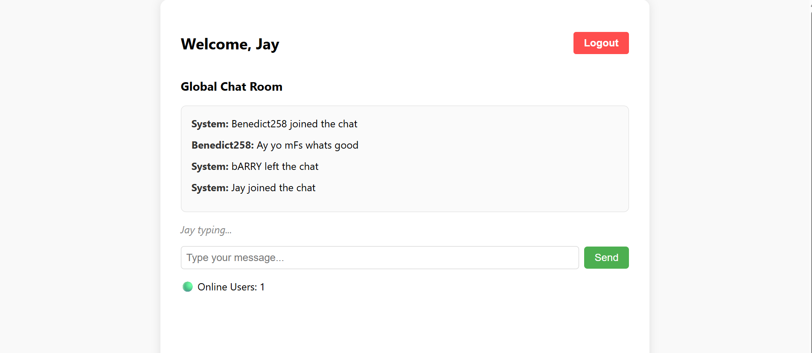
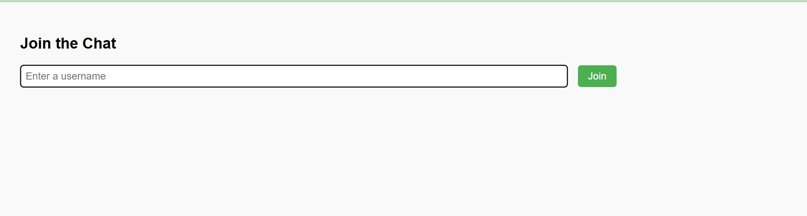

# 💬 Real-Time Chat App (Socket.io + React + Node.js)

This project is a full-stack real-time chat application built with **React**, **Socket.io**, and **Node.js (Express)**. It allows users to connect instantly, exchange messages in a global chat room, see who’s online, and view typing indicators in real time.

---

## 🚀 Features

### ✅ Core Features
- 🔓 Username-based login
- 💬 Global chat room with instant messaging
- 🧑‍🤝‍🧑 Online/offline user status updates
- 📝 Typing indicator
- ⏱️ Timestamped messages

### 🌟 Advanced Features
- ✉️ Private messaging support
- ⚡ Real-time updates using Socket.io
- 🧠 Multiple users can chat simultaneously
- 🎯 At least 3 advanced features implemented ✅

---

## 🖼️ Preview




---

## ⚙️ Tech Stack

| Frontend         | Backend        | Real-Time Engine |
|------------------|----------------|------------------|
| React + Vite     | Node.js + Express | Socket.io       |

---

## 📦 Installation & Setup

### 🖥️ Server Setup (Backend)
```bash
cd server
npm install
npm run dev
🌐 Client Setup (Frontend)
bash
Copy
Edit
cd client
npm install
npm run dev
Ensure the .env file in the server has:

env
Copy
Edit
CLIENT_URL=http://localhost:5173
PORT=5000
🌍 Deployment
✅ Optional but recommended for full marks

🔗 Live URLs (replace with yours):
Frontend (Vercel): https://your-chat-frontend.vercel.app

Backend (Render/Railway): https://your-chat-backend.onrender.com

📝 How It Works
Client connects to the backend via Socket.io

On login, the username is stored locally

Messages are broadcast in real time to all connected users

Server manages user presence, typing status, and message events

✅ Assignment Objectives Covered
 Real-time messaging with bidirectional communication

 Typing indicators

 User join/leave notifications

 Private messages

 Online status updates

 Clean and responsive UI